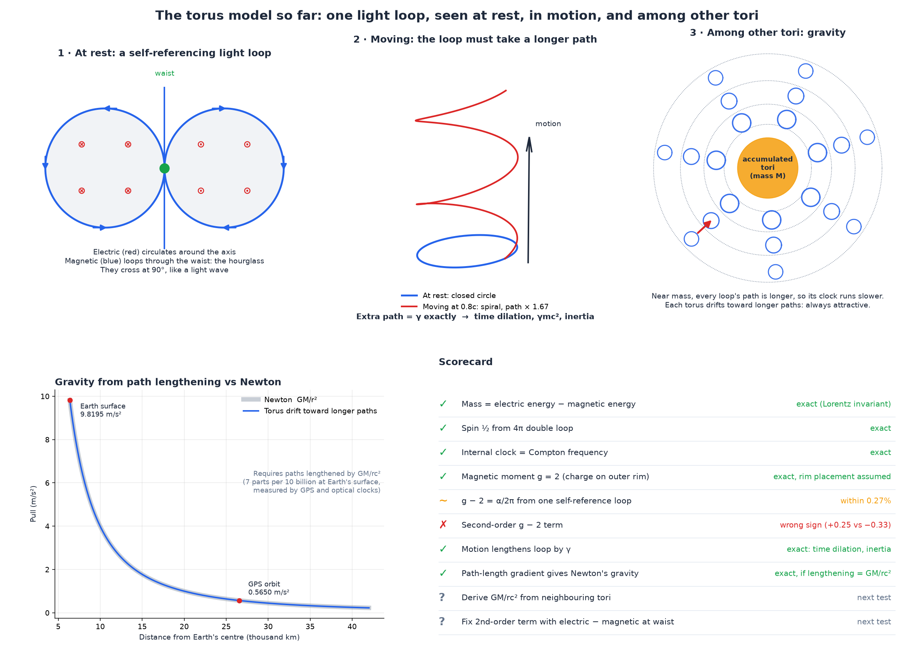
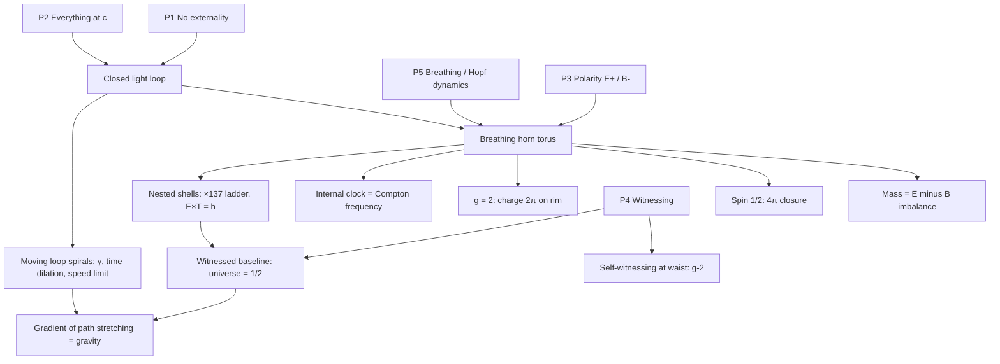
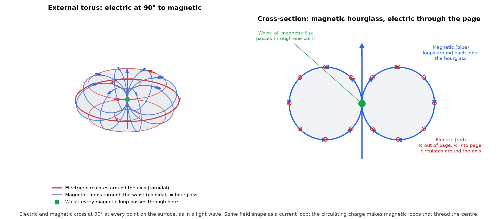
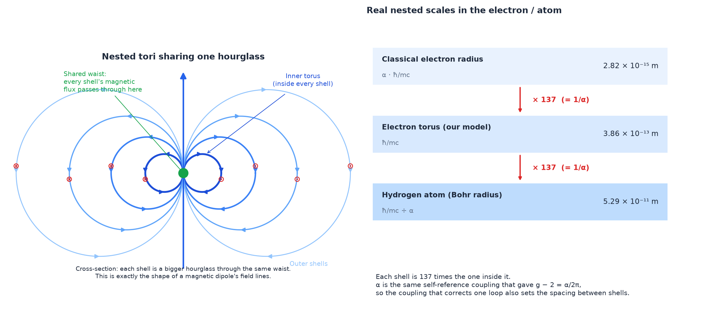

# The Torus Light Model: Concept Map

> Working map of a concept, not a proof. It lays out the ideas, how they connect, and
> which numbers have been checked against known physics so far. This folder stands on its
> own; the older φ-framework elsewhere in this repo was used as a reference only.

---

## 0. The idea in one paragraph

Every particle is **light that has closed on itself**. The loop lives on a **breathing
torus** whose field lines form the **Hopf fibration**. The **electric** flow circulates around
the axis (+) and the **magnetic** flow loops through the waist at 90° (−); together they form
a **polarity pair**. Nothing is outside the loop, so it has nowhere to go. It holds because
there is **no externality**. Every loop **witnesses** itself and every other loop at light
speed. At small scale, the *direction* of circulation shows up as charge and
electromagnetism. At large scale, directions cancel and only the *amount* of circulation
(energy) remains; its accumulated witnessing stretches every loop's path, and the gradient
of that stretching is **gravity**.

---

## 1. Primitives

| # | Primitive | Statement |
|---|---|---|
| P1 | **No externality** | The loop is closed on itself. There is no "outside" for it to leak into, so nothing external is needed to hold it together. |
| P2 | **Everything moves at c** | Light is the only motion. Mass is light going around a closed loop; rest is light that makes no net progress. |
| P3 | **Polarity** | Electric (+) and magnetic (−) are an orthogonal pair. Mass is the imbalance: E² − c²B². |
| P4 | **Witnessing** | Every loop receives light from itself and every other loop at speed c. Timing (closure and meeting), not distance, sets structure. |
| P5 | **Breathing** | A static structure collapses. The torus contracts and expands, and the Hopf fibration is its dynamic form. |

---

## 2. The single loop

| Element | Geometry | Carries | Gives |
|---|---|---|---|
| **Core circle** | Radius ħ/2mc, winds twice (4π) | Energy | Spin ½, mass, internal clock |
| **Outer rim** | Radius ħ/mc, winds once (2π) | Charge (electric, +) | Magnetic moment, g = 2 |
| **Hourglass** | Poloidal loops through the waist | Magnetic (−) | Orthogonal partner of the electric flow |
| **Waist** | The single pinch point of the horn torus | All magnetic flux; self-witnessing | Sign flip each pass; g − 2 corrections |
| **Breath** | Contraction ↔ expansion | Exchange between the two phases | Stability (static collapses); Zitterbewegung (amplitude ħ/2mc, frequency 2mc²/ħ) |

**Timing sets the geometry.** Both loops move at c, are one Compton wavelength long,
and share a period. That common period, where the two loops witness each other once per
cycle, is what places the charge at twice the core radius.

**No externality (P1).** Maxwell's Hopf-linked fields (Rañada 1989) spread out in
ordinary open space. Those fields are built by projecting a structure defined on a closed
space (the 3-sphere), and on that closed space there is no infinity to spread into. The
map's position is that the loop *is* the closed space. What holds light in the loop is the
absence of anywhere else to go.

**Sign flips at the centre.** Each pass through the waist flips the sign. One pass (2π)
gives −1 and two passes (4π) return to +1, which is spin-½ behaviour. The same flip sets
the alternating signs of the self-witnessing corrections.

---

## 3. Across scales

| Situation | Mechanism | Result |
|---|---|---|
| **At rest** | Light circulates, closes, and witnesses itself | Mass, spin, clock, charge, magnetism |
| **Moving at v** | The loop must spiral to close; speed left for going around = c/γ | Time dilation and inertia. At v = c the loop never closes (time stops, it unwinds into light); above c no loop exists |
| **Among other loops** | Witnessed energy stretches every loop's path by Σ GM/(r c²) | Clocks slow near mass; each loop drifts toward longer paths: gravity, always attractive |
| **Nested shells** | Shells share one hourglass and waist (the shape of dipole field lines) | Each ring: energy × period = h. Bigger rings are slower and lighter; a full shell's total energy grows with its size |
| **The universe** | The outermost shell, GM/Rc² = ½ | The hidden baseline every instrument is calibrated to; only gradients are felt |

**Direction versus amount.** Charge is the *direction* of circulation (±), so it cancels
in bulk. Energy is the *amount* (always +), so it accumulates. Electromagnetism dominates
small scales and gravity dominates large ones. On this map they are one circulation seen
at different scales.

**The magnetic part keeps gravity current.** A loop witnesses a moving source where it
*was*. The velocity-dependent (magnetic-type) part of the witnessed field corrects the
direction exactly to where the source *is now*. Without it, orbits would be unstable
(Laplace).

---

## 4. Consistency checks run so far

Scripts are in [`scripts/`](scripts/). "Recovered" means the check reproduces known
physics. That shows the map is consistent with it, not that the map is correct.

| # | Check | Result | Kind |
|---|---|---|---|
| 1 | (U_E − U_B)·γ = mc² for a moving charged shell | Exact at every speed | Recovered |
| 2 | Loop of length h/mc at c: clock frequency | 1.2356 × 10²⁰ Hz = Compton frequency | Recovered |
| 3 | 4π energy loop at ħ/2mc: spin | ħ/2 exactly | Model |
| 4 | Charge riding with the energy, any torus knot | g = 1 always, so geometry alone can't give 2 | Constraint |
| 5 | Energy 4π at r, charge 2π at 2r, shared period | g = 2.0000 exactly | Model (rim placement assumed) |
| 6 | Charge meets its own light after one full loop (λ_C) | g − 2 ≈ α/2π, within 0.27% | Model |
| 7 | Sign flip at every waist pass: a = f/(1+f) | 4.1 × 10⁻⁷ off; second order −0.25 vs QED −0.328 | Partial (sign ✓, size 76%) |
| 8 | Signs of the corrections, orders 1–5 | + − + − +, matching QED | Model |
| 9 | Moving loop path length | = γ exactly (0.1c–0.99c) | Recovered |
| 10 | Path-stretching gradient with GM/rc² | Newton's g at Earth, Sun and GPS orbit | Recovered |
| 11 | Universe of loops with 1/r witnessing | Uniform baseline ½; local clump gives G_eff M/r² (ratio → 1.000) | Model (1/r assumed) |
| 12 | Witnessing with light delay | Points to present position once the velocity term is included | Recovered |
| 13 | Energy × period for proton, electron and hydrogen shell | = h for each | Recovered |
| 14 | Length ladder r_e → ħ/mc → a₀ | Each step ×137 (1/α) | Exact identity; nesting is interpretation |

The 4/3 problem shows that a *static* electromagnetic shell carries 4/3 of the momentum it
should. That is consistent with P5: static collapses. The map's claim is that the breath
fixes this, because the internal pressure only has to average to zero over one cycle
(von Laue's condition for dynamic systems).

---

## 5. What still needs mapping

These are gaps in the map, not demands for proof.

**Inside the loop**
1. Why the charge takes the rim (2π) and the energy the core (4π). Possibly the two phases of the breath.
2. How many routes pass through the waist at each order, and with what weight. QED has 1, 7, 72, 891, 12,672 paths at successive orders; the map should say what these are on the torus.
3. The breath itself: what sets its rhythm, and how expansion and contraction trade electric and magnetic energy.
4. "No externality" in detail: how the loop's closed space relates to the space we measure in.

**Between loops**

5. Why witnessing falls off as 1/r. Likely because it's carried by the radiation (wave-amplitude) part of the field.
6. Why light bends twice as much as the naive estimate: stretching must act on both space and time.
7. Gravitational waves: how ripples in the witnessed baseline show two tensor polarizations.
8. Why every kind of loop falls the same way (equivalence principle).

**Numbers the map should eventually produce**

9. The fine-structure constant (1/α = 137.036), and why each nested step is ×137.
10. Proton / electron = 1,836.15: why the proton ring is that much tighter.
11. The muon and tau as higher modes of the same loop.

**Observations the map could predict**

12. Where the witnessed baseline differs from ours, in galaxy outskirts, wide binaries and voids, and what deviation that would produce.

---

## 6. Quick reference

| Symbol | Meaning | Value (electron) |
|---|---|---|
| ħ/2mc | Core radius (energy loop, Zitterbewegung amplitude) | 1.93 × 10⁻¹³ m |
| ħ/mc | Rim radius (charge loop) | 3.86 × 10⁻¹³ m |
| h/mc | Loop length (Compton wavelength) | 2.43 × 10⁻¹² m |
| mc²/h | Loop clock (Compton frequency) | 1.2356 × 10²⁰ Hz |
| α | Self-witnessing coupling | 1/137.036 |
| GM/rc² | Fraction by which a mass stretches nearby loop paths | 7 × 10⁻¹⁰ at Earth's surface; ½ for the whole universe |
| γ | Path stretch of a moving loop | 1/√(1 − v²/c²) |

## 7. Files

- `figures/`: diagrams. `early-internal-version.png` is superseded by `horn_torus_EM.png`.
- `scripts/01–07`: the consistency checks in Section 4. Run with `python3` (needs numpy/scipy).
- `scripts/fig_*.py`: regenerate the figures.
- `scripts/audit-of-old-framework/`: precision check of the older φ-framework's predictions (1/α and m_μ/m_e miss measured values by 8,400σ and 285σ; m_τ fits; the two gravity formulas disagree by 0.65%), plus a look-elsewhere test (random numbers in 100–5,000 match a formula in that family to within 0.0006% about 0.1% of the time).
